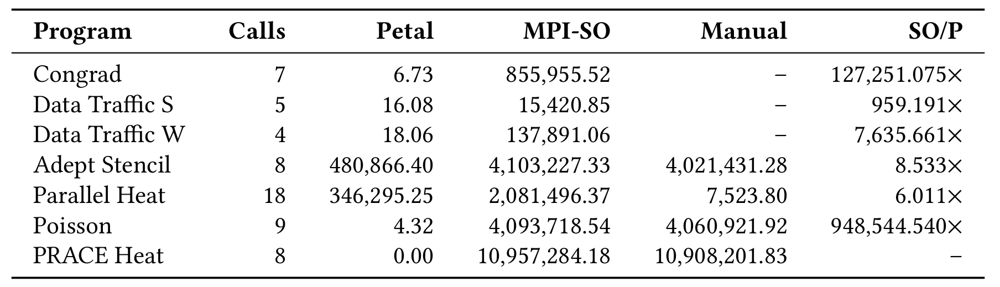
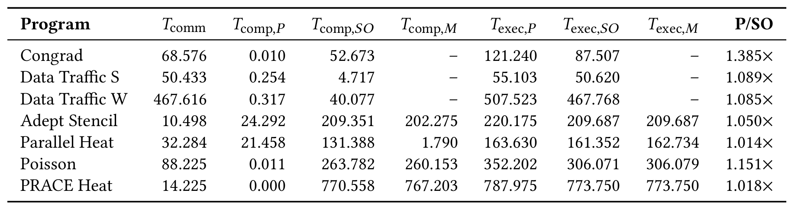
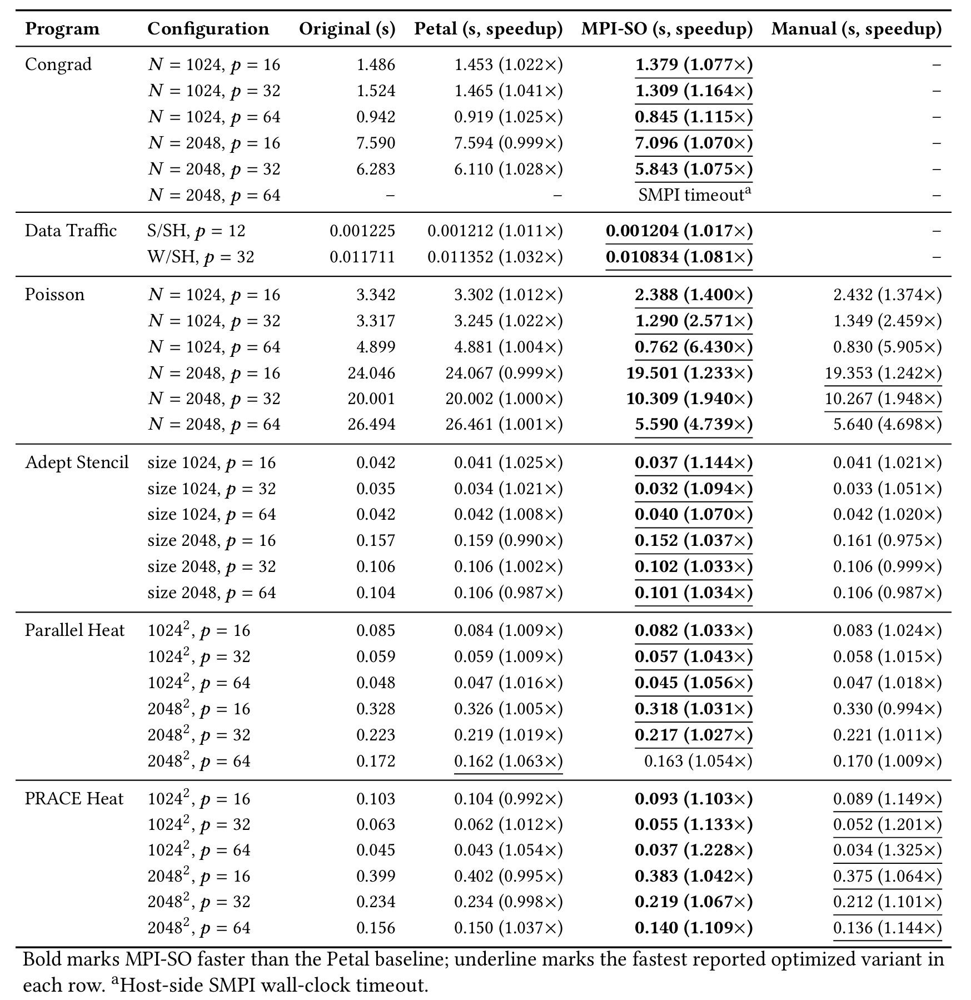

# MPI-SO Artifact

This repository documents the experimental artifact for MPI-SO. The artifact
is distributed as a prebuilt Docker image. This GitHub repository
contains only this guide and the result figures.

## Docker Image

Docker Hub: [mpisoartifact/mpiso-artifact](https://hub.docker.com/r/mpisoartifact/mpiso-artifact)

```text
Image:  mpisoartifact/mpiso-artifact:submission-v2
Digest: sha256:852f81cfa60e6c93acfccc6fe442458c62a530ab6289ad37a55170f35f47b815
```

The image contains prebuilt MPI-SO, SVF, and SimGrid executables, their runtime
libraries, the prebuilt benchmark variants and inputs needed for RQ2, and the
complete reference RQ1/RQ2 tables. It contains no C/C++ implementation or
benchmark source files.

Pull the immutable image with:

```bash
docker pull mpisoartifact/mpiso-artifact@sha256:852f81cfa60e6c93acfccc6fe442458c62a530ab6289ad37a55170f35f47b815
```

All commands below use the readable `submission-v2` tag. The digest form may
be substituted to pin the exact image.

## Requirements

- x86-64 Linux with Docker Engine;
- 4 CPU threads, 8 GiB RAM, and a few GiB of free disk for the quick run;
- 16 or more CPU threads, 32 GiB RAM, and at least 20 GiB of free disk for
  selective or full runs;
- no concurrent full artifact runs on the same host.

The packaged toolchain uses Ubuntu 22.04, LLVM/Clang 15, and SimGrid 4.0. The
reported evaluation used `smpi/host-speed=6.643Gf`; the runner uses the same
value by default. Host load and processor performance affect wall-clock cost
and can also perturb small SMPI measurements, so a rerun need not reproduce
every last decimal from the reference server.

Create a host result directory before running an experiment:

```bash
mkdir -p results
```

The `--user` option used below keeps mounted result files owned by the current
user rather than by root.

## Reference Validation

Verify and summarize the complete published RQ1/RQ2 tables:

```bash
docker run --rm \
  mpisoartifact/mpiso-artifact:submission-v2 reference
```

Check that the packaged MPI-SO, SVF, and SimGrid executables start correctly:

```bash
docker run --rm \
  mpisoartifact/mpiso-artifact:submission-v2 health
```

These commands do not rerun an experiment.

## Quick Run

Run the Poisson `n=1024`, `NP=32` configuration once for Original, Petal,
MPI-SO, and Manual:

```bash
docker run --rm \
  --user "$(id -u):$(id -g)" \
  -v "$PWD/results:/results" \
  mpisoartifact/mpiso-artifact:submission-v2 quick
```

This formal configuration provides a short end-to-end demonstration with a
clear MPI-SO improvement. It normally takes about four to eight minutes on a
workstation. Because `quick` performs only one repetition, its measurements are
illustrative rather than paper results. Results are written under
`results/quick-<timestamp>/`.

## Selective Runs

List all packaged paper configurations and their variants:

```bash
docker run --rm \
  mpisoartifact/mpiso-artifact:submission-v2 list
```

Run every configuration of one benchmark. The final argument is the repeat
count; this example runs each Adept configuration five times:

```bash
docker run --rm \
  --user "$(id -u):$(id -g)" \
  -v "$PWD/results:/results" \
  mpisoartifact/mpiso-artifact:submission-v2 program adept 5
```

Run one configuration five times:

```bash
docker run --rm \
  --user "$(id -u):$(id -g)" \
  -v "$PWD/results:/results" \
  mpisoartifact/mpiso-artifact:submission-v2 \
  run poisson n1024-np16 5
```

Valid program names are `congrad`, `dt-s`, `dt-w`, `poisson`, `adept`,
`parallel`, and `prace`. Use `list` for exact configuration names. Selective
results are stored under `results/program-<program>-<timestamp>/` or
`results/run-<program>-<configuration>-<timestamp>/`.

## Full RQ2 Run

Run all 32 paper configurations with five repetitions:

```bash
docker run --rm \
  --user "$(id -u):$(id -g)" \
  -e RUN_TIMEOUT=21600 \
  -e REPEATS=5 \
  -v "$PWD/results:/results" \
  mpisoartifact/mpiso-artifact:submission-v2 full
```

This launches 600 variant runs. Each individual variant has a six-hour
wall-clock timeout. If a variant times out once, its later repetitions are
skipped, while the timeout status and log are retained. In particular, the
full command actually launches Original, Petal, and MPI-SO for Congrad
2048/NP64; it does not pre-mark that configuration as timed out.

Allow roughly two to three days on a workstation, and potentially longer on a
slower or heavily loaded host. The completed reference-server RQ2 executions
accounted for about 21 hours before Manual runs and the timed-out Congrad case;
the latter can add up to 18 hours because its three variants are attempted
separately. Full results are written under `results/full-<timestamp>/`.

Every dynamic run produces:

- `runs.tsv`: status, simulated time, host wall time, output-equivalence result,
  and log path for every executed sample;
- `summary-rq2.tsv`: per-variant mean, standard deviation, valid-repeat count,
  output validity, and speedup over Original;
- raw logs and normalized application output for auditing failures or output
  mismatches.

The commands above reproduce the ordinary RQ2 executions. In the original
evaluation workflow, the same transformed programs were subsequently compiled
as profiling variants and run five times with one representative RQ2 runtime
configuration per program. Those follow-on runs produced the dynamic window
instruction counts and times reported for RQ1.

### Approximate Runtime Budget

The analysis was performed once per program and its generated executables were
reused across runtime configurations. The Docker dynamic commands therefore
rerun RQ2 simulation, not symbolic execution. The following measurements are
from the final reference-server experiment and are planning estimates only.

| Program | MPI-SO symbolic execution | One SMPI variant run | Notes |
| --- | ---: | ---: | --- |
| Adept Stencil | about 48 s | less than 1 s to 4 s | Six runtime configurations |
| Parallel Heat | about 36 s | 1-6 s | Six runtime configurations |
| PRACE Heat | about 18 s | 2-9 s | Six runtime configurations |
| Congrad | about 18 s | 42 s-27 min | 2048/NP64 may reach the 6 h limit |
| Poisson | about 5 min 35 s | 56 s-14 min | Six runtime configurations |
| Data Traffic S | about 1 h 7 min | less than 1 s | One runtime configuration |
| Data Traffic W | 8 h timeout | less than 1 s | Strategies found before timeout are retained |

The SMPI ranges are host wall time for one Original, Petal, or MPI-SO launch,
not simulated application time. A complete configuration comprises three such
launches, or four when a Manual variant is available, multiplied by the chosen
repeat count.

## Evaluation Results

We evaluate six programs: Congrad, Data Traffic, Poisson, Adept Stencil,
Parallel Heat, and PRACE Heat. Data Traffic contributes separate S and W
configurations. Petal is the primary static-analysis baseline. Original is the
unoptimized program used to calculate end-to-end speedup, while Manual denotes
the original hand-written nonblocking implementation when available.

Each completed runtime configuration is simulated five times with SimGrid/SMPI.
Speedup is the ratio of the Original mean time to the corresponding variant's
mean time. RQ1 values are weighted by the number of executed request instances.

### RQ1: Overlapping Windows

Each RQ1 row summarizes five profiling runs of one representative configuration
drawn from the corresponding program's RQ2 runtime configurations.

MPI-SO enlarges the effective computation window for all seven program and
analysis configurations. The estimated Petal-to-MPI-SO window speedup ranges
from 1.014x to 1.385x. PRACE Heat has zero-length Petal windows for the measured
calls but nonzero windows under MPI-SO; its instruction ratio is therefore
reported as a newly established window rather than a finite multiplier.





### RQ2: End-to-End Performance

The evaluation contains 32 runtime configurations. Thirty-one complete with
five valid repetitions; Congrad 2048/NP64 reaches the documented host-side SMPI
timeout. MPI-SO improves all 31 completed configurations over Original, with
speedups from 1.017x to 6.430x, and outperforms Petal in 30 of them. Among the
24 configurations with a Manual implementation, MPI-SO is faster in 16.

MPI-SO's advantage over Petal follows from later completion points on explored
paths. End-to-end performance also depends on request-completion overhead and
communication progress. This explains the single Parallel Heat configuration
where Petal is slightly faster. Manual grouped completion is particularly
effective in PRACE Heat, whereas MPI-SO can outperform Manual when completing
individual requests later avoids waiting for unrelated communication.



## Packaged Reference Data

The container includes the complete machine-readable tables used for the
figures and summary above:

- one row per RQ2 runtime configuration, including all five raw measurements;
- program-level and communication-call-level RQ1 results;
- the PSE/PSA strategy coverage audit;
- the documented timeout status.

The `reference` command verifies the expected row counts and validity fields.
To extract the tables:

```bash
container=$(docker create mpisoartifact/mpiso-artifact:submission-v2)
docker cp "$container:/opt/mpiso/reference-results" ./reference-results
docker rm "$container"
```

The binary-only dynamic workflow reproduces RQ2 from prebuilt executables.
Regenerating the follow-on RQ1 profiles is outside this package because it
requires rebuilding profiling variants and retaining large per-instance traces;
the complete call-level and program-level RQ1 evidence remains available
through `reference-results`.
